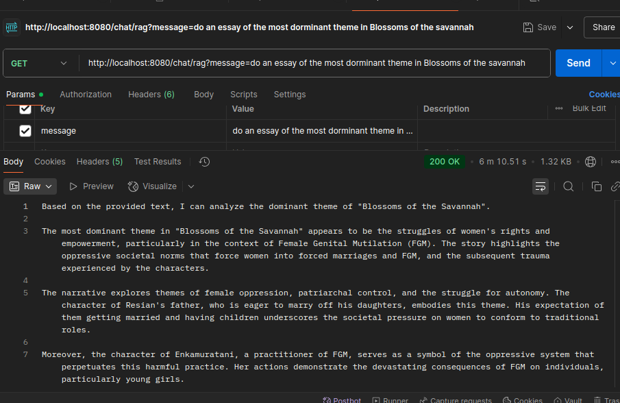
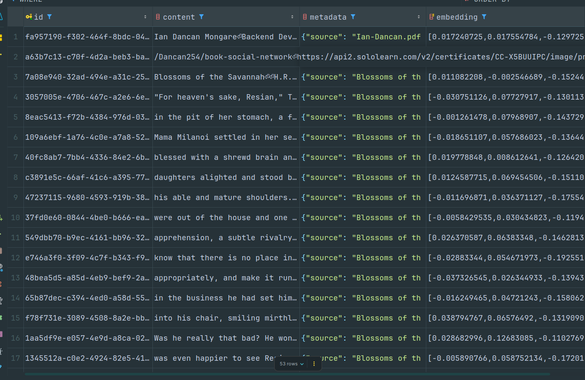

# Ollama Spring RAG Application

A powerful Retrieval-Augmented Generation (RAG) application built with Spring Boot, Spring AI, Ollama, and pgvector. This application enables intelligent question-answering by combining document retrieval with AI-powered responses.

## 🚀 Features

- **Document Processing**: Automatically processes PDF documents and splits them into searchable chunks
- **Vector Storage**: Utilizes pgvector for efficient semantic search and similarity matching
- **RAG Implementation**: Combines document retrieval with AI generation for context-aware responses
- **Ollama Integration**: Leverages local Ollama models for chat and embeddings
- **RESTful API**: Simple HTTP endpoints for interacting with the RAG system

## 🏗️ Architecture

The application follows a clean architecture pattern:

- **OllamaRAGService**: Handles document ingestion, processing, and vector storage
- **ChatController**: Provides REST endpoints for chat interactions
- **pgvector**: Vector database for storing and retrieving document embeddings
- **Ollama**: Local AI model serving for chat and embeddings

## 📋 Prerequisites

Before running this application, ensure you have the following installed:

- **Java 17+**
- **Maven 3.6+**
- **Docker & Docker Compose**
- **Ollama** (running locally on port 11434)

### Setting up Ollama

1. Install Ollama from [https://ollama.ai](https://ollama.ai)
2. Pull the required models:
   ```bash
   ollama pull llama3.2
   ollama pull nomic-embed-text
   ```
3. Ensure Ollama is running on `http://localhost:11434`

## 🛠️ Installation & Setup

### 1. Clone the Repository
```bash
git clone https://github.com/Dancan254/ollama-spring
cd ollama-spring
```

### 2. Start the Database
```bash
docker-compose up -d pgvector
```

### 3. Prepare Your Documents
Place your PDF documents in the `src/main/resources/data/` directory. The application currently processes "Blossoms of the Savannah.pdf" by default.

### 4. Build and Run
```bash
./mvnw clean install
./mvnw spring-boot:run
```

## 🔧 Configuration

The application can be configured through `application.yml`:

```yaml
spring:
  datasource:
    url: jdbc:postgresql://localhost:5435/ollama
    username: postgres
    password: postgres
  ai:
    ollama:
      base-url: http://localhost:11434
      chat:
        model: llama3.2
      embedding:
        model: nomic-embed-text
    vectorstore:
      pgvector:
        index-type: HNSW
        distance-type: COSINE_DISTANCE
        dimensions: 768
        max-document-batch-size: 10000
        initialize-schema: true
        remove-existing-vectors-on-write: true
```

### Configuration Options

- **Database**: PostgreSQL with pgvector extension
- **Vector Index**: HNSW (Hierarchical Navigable Small World) for fast similarity search
- **Distance Metric**: Cosine distance for semantic similarity
- **Embedding Dimensions**: 768 (matches nomic-embed-text model)
- **Batch Size**: 10,000 documents per batch for efficient processing

## 📚 API Endpoints

### Chat with RAG
```http
GET /chat/rag?message=Your question here
```

**Example:**
```bash
curl "http://localhost:8080/chat/rag?message=What is the main theme of the book?"
```

**Response:**
```json
"Based on the document, the main theme revolves around..."
```
**Sample Response:**
```bash
curl "http://localhost:8080/chat/rag?message=do an essay of the most dorminant theme in Blossoms of the savannah"
```

## 🔄 How It Works

1. **Document Ingestion**: On startup, the application:
    - Reads PDF documents using TikaDocumentReader
    - Splits documents into chunks using TokenTextSplitter
    - Generates embeddings using the nomic-embed-text model
    - Stores vectors in pgvector database

2. **Query Processing**: When a user asks a question:
    - The question is converted to an embedding
    - Similar document chunks are retrieved from pgvector
    - Retrieved context is combined with the user's question
    - Ollama generates a response using the llama3.2 model

## 🗂️ Project Structure

```
src/
├── main/
│   ├── java/com/javaguy/ollamaspring/
│   │   ├── OllamaRAGService.java      # Document processing service
│   │   ├── ChatController.java        # REST API controller
│   │   └── OllamaSpringApplication.java
│   └── resources/
│       ├── data/                      # PDF documents directory
│       │   └── Blossoms of the Savannah.pdf
│       └── application.yml            # Configuration
├── docker-compose.yml                 # pgvector database setup
└── pom.xml                           # Maven dependencies
```

## 🔍 Key Dependencies

- **Spring Boot**: Application framework
- **Spring AI**: AI integration framework
- **Ollama**: Local AI model integration
- **pgvector**: Vector database for PostgreSQL
- **Apache Tika**: Document processing and text extraction

## 🚀 Usage Examples

### Basic Question
```bash
curl "http://localhost:8080/chat/rag?message=Who are the main characters?"
```

### Complex Query
```bash
curl "http://localhost:8080/chat/rag?message=What lessons can be learned from this story?"
```

### Specific Information
```bash
curl "http://localhost:8080/chat/rag?message=Describe the setting of the story"
```

## 🔧 Customization

### Adding New Documents
1. Place PDF files in `src/main/resources/data/`
2. Update the `@Value` annotation in `OllamaRAGService.java`
3. Restart the application

### Changing AI Models
Update the model names in `application.yml`:
```yaml
spring:
  ai:
    ollama:
      chat:
        model: llama3.1  # or any other Ollama model
      embedding:
        model: all-minilm  # or any other embedding model
```

### Vector Store Configuration
Adjust vector store parameters for optimal performance:
```yaml
spring:
  ai:
    vectorstore:
      pgvector:
        dimensions: 768  # Match your embedding model
        distance-type: L2  # or COSINE_DISTANCE, INNER_PRODUCT
```

## 🐛 Troubleshooting

### Common Issues

1. **Ollama Connection Error**
    - Ensure Ollama is running: `ollama serve`
    - Check if models are available: `ollama list`

2. **Database Connection Error**
    - Verify pgvector container is running: `docker ps`
    - Check database credentials in `application.yml`

3. **Document Processing Issues**
    - Ensure PDF files are in the correct directory
    - Check file permissions and readability

### Logs
Monitor application logs for detailed error information:
```bash
./mvnw spring-boot:run --debug
```

## 📈 Performance Optimization

- **Batch Processing**: Increase `max-document-batch-size` for large documents
- **Vector Index**: Use HNSW for fast similarity search
- **Connection Pooling**: Configure database connection pool for high load
- **Caching**: Consider implementing response caching for frequent queries

## 🤝 Contributing

1. Fork the repository
2. Create a feature branch
3. Commit your changes
4. Push to the branch
5. Create a Pull Request

## 📄 License

This project is licensed under the MIT License - see the LICENSE file for details.

## 🙏 Acknowledgments

- Spring AI team for the excellent framework
- Ollama for providing local AI model serving
- pgvector for efficient vector storage
- Apache Tika for document processing capabilities

---

**Built with ❤️ using Spring Boot and Spring AI**
